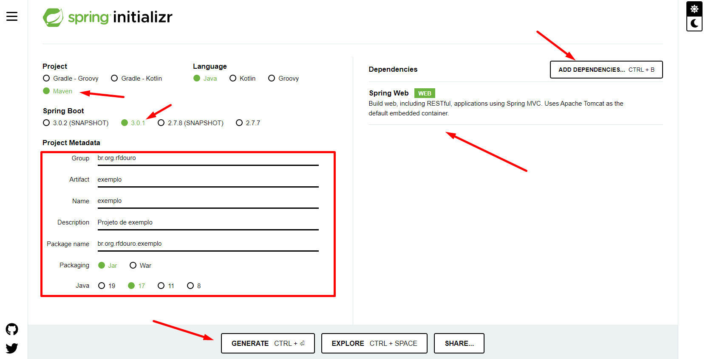

Criando um Projeto
=====================================================

Iremos criar um projeto Maven com as seguintes especificações
3.1) O que acontece depois que faço uma Nova Solicitação?
-----------------------------------------------------------------------

Ao realizar uma Nova Solicitação de Requerimento de Autorização de Pesquisa Mineral, a Solicitação aparecerá no topo da lista de Requerimentos com a situação de “Aguardando Pagamento”. 

3.2) Quanto tempo leva para o sistema reconhecer que o boleto foi pago?
-----------------------------------------------------------------------

Após o pagamento do boleto, o sistema leva, normalmente, dois dias úteis para atualizar a Situação do seu boleto para “Pago”.

.. image:: ../imagens/image.png
